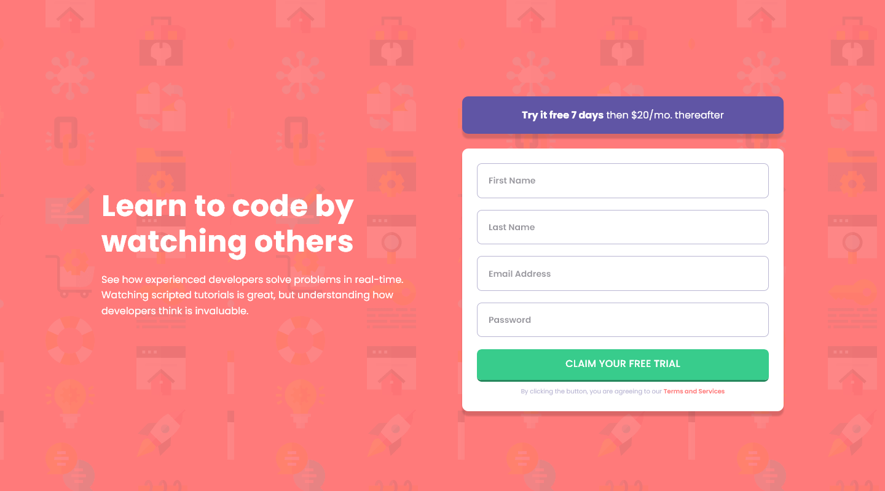

  
  <h2 align="left">Frontend Mentor - Intro component with sign up form solution</h2>

This is a solution to the [Intro component with sign up form challenge on Frontend Mentor](https://www.frontendmentor.io/challenges/intro-component-with-signup-form-5cf91bd49edda32581d28fd1). Frontend Mentor challenges help you improve your coding skills by building realistic projects.

<!--  -->

&dot;
 
&dot;

---

### The challenge

Users should be able to:

- View the optimal layout for the site depending on their device's screen size
- See hover states for all interactive elements on the page
- Receive an error message when the `form` is submitted if:
  - Any `input` field is empty. The message for this error should say _"[Field Name] cannot be empty"_
  - The email address is not formatted correctly (i.e. a correct email address should have this structure: `name@host.tld`). The message for this error should say _"Looks like this is not an email"_

### Screenshot

### Built with

- Semantic HTML5 markup
- CSS custom properties
- Flexbox
- CSS Grid
- Mobile-first workflow
- JavaScript

### Useful resources

- [How To Create Accessible Form with Boring Design? ](https://community.codenewbie.org/vanzasetia/how-to-create-accessible-form-with-boring-design-4ab0) - It helped me to improve the accessibility in the form.

---

### Author

- Frontend Mentor - [@mateusbelicio](https://www.frontendmentor.io/profile/mateusbelicio)
- Linkedin - [@mateusbelicio](https://www.linkedin.com/in/mateusbelicio)
